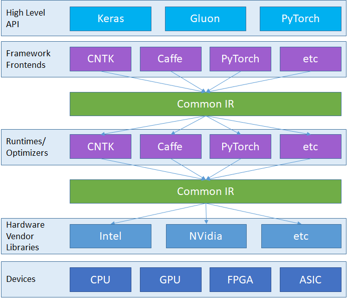

Overview
========

Deep learning with neural networks is accomplished through computation
over dataflow graphs. Some frameworks such as CNTK, Caffe2, Theano, and
TensorFlow make use of static graphs while some like PyTorch and Chainer
use dynamic graphs. However, they all provide interfaces that make it
easier for developers to construct these computation graphs, and
runtimes that process the graphs in an optimized fashion. The graph
serves as an intermediate representation (IR) that captures the intent
of the developer’s source code and is conducive for optimization and
translation to something that runs on specific devices (CPU, GPU, FPGA,
etc.).

Why a common IR?
----------------

Today each framework has its own proprietary representation of the
graph, though they all provide similar capabilities. This means each
framework is a siloed stack of API, graph, and runtime. Furthermore,
each framework has optimized for some characteristic such as fast
training, being easy to learn, supporting complicated network
architecture, inferencing on mobile devices, etc. Developers have to
choose the characteristic that matters most to them and pick a
framework. Many times, the characteristic most important during research
and development is different than the one most important for shipping to
production. This leads to significant delays between completion of
development and start of shipping because the solution needs to be
converted.

With the goal of democratizing AI, we envision developers choosing the
framework that works best for the stage they are at and easily switching
between frameworks as needed. We propose a common IR to help establish
this powerful ecosystem.

By providing a common representation of the computation graph, the
common IR helps decouple the API front-ends from the runtime back-ends.
Framework authors can focus on the scenario they want to optimize rather
than the whole stack. Hardware vendors can target the common IR rather
than multiple, separate frameworks.

